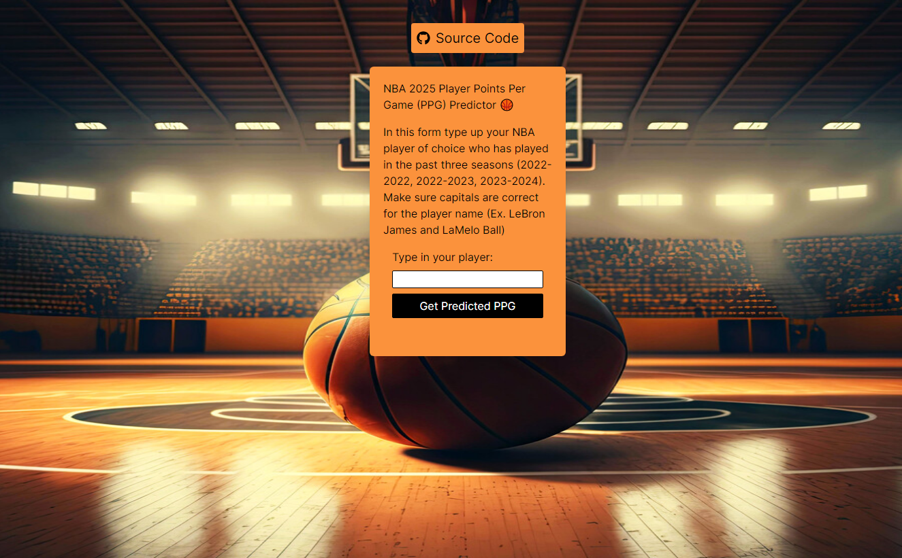

# NBA Player Points Per Game Prediction Model

## Visit the Deployed App 

[Deployed PPG Predictor](https://nba2025ppg-predictior.vercel.app/)

## About

Created a prediction model to predict a players points per game
(PPG) stat for the upcoming 2024-2025 season based on their PPG from the past 3 seasons (2022-2022, 2022-2023, 2023-2024).
Used a Linear Regression model using sklearn to combine a player's data from all three seasons to help predict their PPG in the upcoming 2024-2025 season.

## Key Responsibilities

## Technologies Used

Backend: Python, Flask, Pandas, ScikitLearn, Joblib

Frontend: Next.js, React, Axios, Tailwind, Toastify

Data from Kaggle

## Display

